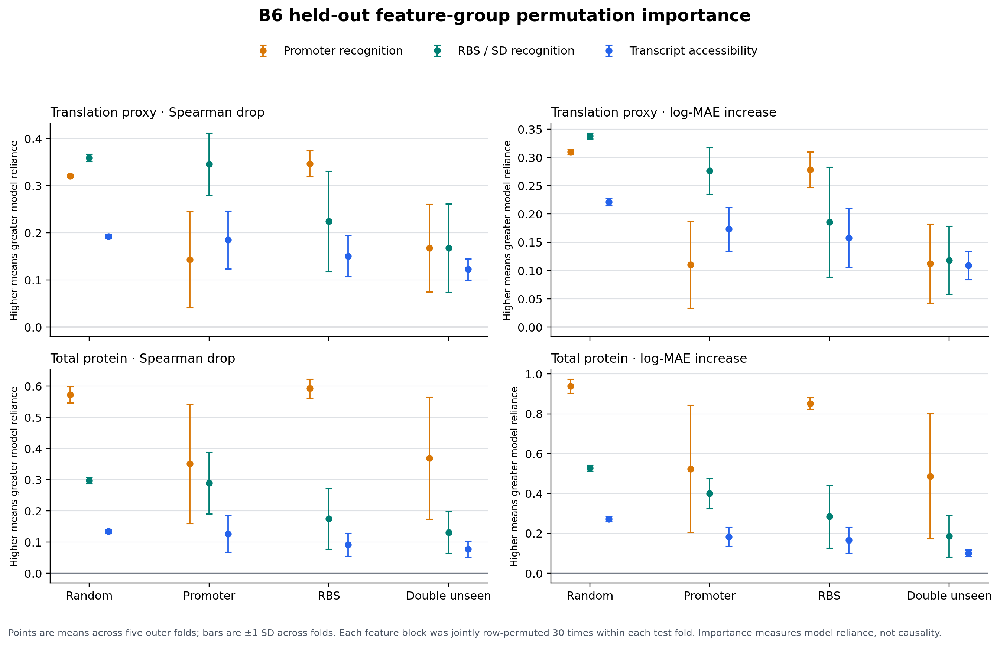
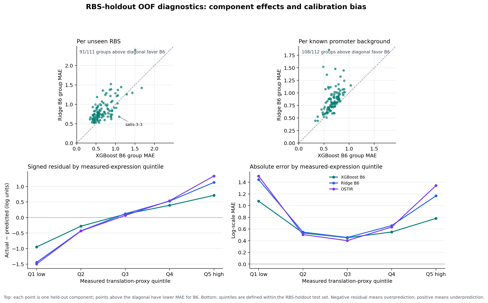
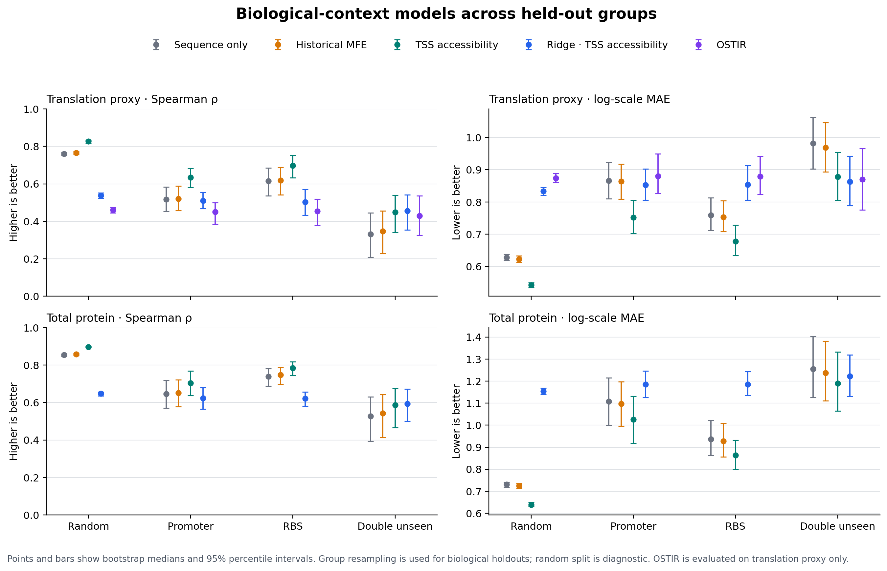

# Biological-context benchmark summary

Project status against the professor's review is recorded in [`professor_feedback_status.md`](../../docs/professor_feedback_status.md). The pJ251-GERC sequence retrieval step is skipped because Addgene registration is inaccessible under the user's current organization circumstances; the reporter CDS remains provisional. Held-out group permutation importance, grouped OOF residual analysis, and four-seed grouped validation are complete.

Dataset: 11,696 constructs with positive RNA and protein values. Targets are `log(prot)`, `log(RNA)`, and `log(prot) - log(RNA)` (steady-state translation proxy). XGBoost models use fixed settings, no hyperparameter search, and a 20% holdout; group split identity is fixed with random seed 42. Scores are a single split, without confidence intervals.

## Translation proxy: historical MFE vs TSS accessibility

| Holdout | n test | Sequence only B4 ρ / MAE | Historical MFE B3 ρ / MAE | TSS accessibility B6 ρ / MAE | Δρ B6−B3 | ΔMAE B6−B3 |
|---|---:|---:|---:|---:|---:|---:|
| Random rows | 2,340 | 0.755 / 0.629 | 0.759 / 0.622 | 0.824 / 0.542 | +0.065 | −0.081 |
| Promoter held out | 2,337 | 0.499 / 0.860 | 0.482 / 0.868 | 0.589 / 0.758 | +0.107 | −0.111 |
| RBS held out | 2,428 | 0.666 / 0.703 | 0.677 / 0.682 | 0.739 / 0.612 | +0.063 | −0.070 |
| Both identities unseen | 490 | 0.382 / 0.944 | 0.410 / 0.920 | 0.496 / 0.841 | +0.086 | −0.079 |

## Total protein prediction

| Holdout | B3 historical MFE ρ / MAE | B6 TSS accessibility ρ / MAE | Δρ B6−B3 | ΔMAE B6−B3 |
|---|---:|---:|---:|---:|
| Random rows | 0.860 / 0.715 | 0.899 / 0.644 | +0.038 | −0.071 |
| Promoter held out | 0.604 / 1.275 | 0.627 / 1.242 | +0.024 | −0.033 |
| RBS held out | 0.791 / 0.852 | 0.828 / 0.784 | +0.037 | −0.068 |
| Both identities unseen | 0.552 / 1.321 | 0.555 / 1.354 | +0.002 | +0.033 |

## Interpretation

The new accessibility features improve the translation proxy on all four fixed holdouts, including unseen RBS and double-unseen combinations. This supports the biological hypothesis that measuring SD/start accessibility in the transcript context adds useful translation-related information. Total-protein Spearman improves for the four holdouts, but log MAE is slightly worse on the strict double-unseen split. The dataset's promoter/RBS component structure and the use of one reporter limit broader interpretation.

This is evidence from one fixed split, not a final statistical claim. Before a top-tier result, repeat with grouped cross-validation, group bootstrap confidence intervals, held-out RBS ranking regret, stability tests across verified CDS references, and the external OSTIR baseline.

## Follow-up validation: grouped CV, OSTIR and group bootstrap

**Run:** 2026-09-30; 5 folds; random seed 42; 1,000 bootstrap replicates with seed 43. OSTIR and the learned baselines use the same 11,672 scored constructs. OSTIR did not return a scored site for 24/11,696 constructs (99.79% coverage); these rows were excluded from all compared methods rather than interpreted as zero. The omitted rows are listed in `ostir_unscored_rows.csv` and involve RBS IDs BBa_J61124, BBa_J61130 and BBa_J61131.

Scores below are the unweighted mean and standard deviation across the five outer folds. B7's log-scale predictions are calibrated by a linear map fitted on each training fold; calibration never uses its test fold. B7 predicts translation initiation, so it is evaluated against the translation proxy only. In double-unseen folds, training rows that touch either held-out group are excluded, test rows are their intersection, and cross-pairs are marked unused.

### Translation proxy (`log(prot/RNA)`)

| Holdout | B4 sequence only ρ | B6 accessibility ρ | B7 OSTIR ρ | B4 MAE | B6 MAE | B7 MAE |
|---|---:|---:|---:|---:|---:|---:|
| Random rows | 0.761 ± 0.010 | 0.827 ± 0.007 | 0.461 ± 0.007 | 0.628 | 0.542 | 0.874 |
| Promoter | 0.530 ± 0.073 | 0.643 ± 0.076 | 0.461 ± 0.078 | 0.865 | 0.752 | 0.879 |
| RBS | 0.601 ± 0.114 | 0.688 ± 0.100 | 0.441 ± 0.087 | 0.759 | 0.679 | 0.878 |
| Double unseen | 0.331 ± 0.118 | 0.461 ± 0.071 | 0.433 ± 0.115 | 0.982 | 0.879 | 0.868 |

Group-bootstrap 95% percentile intervals for paired changes:

| Holdout | Δρ B6−B4 (95% CI) | ΔMAE B6−B4 (95% CI) | Δρ B7−B6 (95% CI) |
|---|---:|---:|---:|
| Promoter | +0.117 [0.088, 0.148] | −0.113 [−0.138, −0.089] | −0.183 [−0.263, −0.104] |
| RBS | +0.081 [0.041, 0.125] | −0.080 [−0.113, −0.046] | −0.242 [−0.324, −0.157] |
| Double unseen | +0.116 [0.059, 0.178] | −0.103 [−0.148, −0.061] | −0.018 [−0.161, 0.131] |

The group-CV results support a consistent gain from TSS-based accessibility over sequence-only features on the translation proxy: B6 improves fold-mean Spearman and MAE in all three biological holdouts, and the paired bootstrap intervals for B6−B4 exclude zero. OSTIR is weaker than B6 on promoter/RBS holdouts; on double-unseen groups the OSTIR−B6 interval includes zero, so neither is shown to be better there.

### End-to-end protein (`log(prot)`)

| Holdout | B4 sequence only ρ | B6 accessibility ρ | B4 MAE | B6 MAE |
|---|---:|---:|---:|---:|
| Random rows | 0.853 ± 0.006 | 0.896 ± 0.007 | 0.730 | 0.640 |
| Promoter | 0.638 ± 0.109 | 0.700 ± 0.098 | 1.112 | 1.030 |
| RBS | 0.735 ± 0.072 | 0.784 ± 0.061 | 0.935 | 0.863 |
| Double unseen | 0.471 ± 0.236 | 0.542 ± 0.198 | 1.261 | 1.193 |

Group-bootstrap paired Δρ intervals for B6−B4 are positive in all four scenarios: random [0.036, 0.050], promoter [0.042, 0.082], RBS [0.020, 0.074], and double unseen [0.016, 0.101]. The corresponding ΔMAE intervals are negative, including double unseen [−0.117, −0.015].

### Algorithm comparison: XGBoost vs Ridge

Ridge uses exactly the same B3/B4/B6 feature sets, outer test rows and targets as XGBoost. Each outer training fold selects Ridge alpha by 3-fold inner CV that follows the outer split type (row, promoter, RBS, or double-unseen); feature scaling is fitted within each inner training fold. Alpha minimizes inner-fold log-scale MAE over `1e-5` to `1e7`. No test-fold data enters scaling or alpha selection. Values below are unweighted mean ± SD across outer folds.

#### Translation proxy (`log(prot/RNA)`)

| Holdout | XGBoost B6 Spearman ρ | Ridge B6 Spearman ρ | XGBoost B6 MAE | Ridge B6 MAE |
|---|---:|---:|---:|---:|
| Random rows | 0.827 ± 0.007 | 0.538 ± 0.015 | 0.542 ± 0.009 | 0.833 ± 0.015 |
| Promoter | 0.643 ± 0.076 | 0.519 ± 0.042 | 0.752 ± 0.051 | 0.851 ± 0.036 |
| RBS | 0.688 ± 0.100 | 0.501 ± 0.096 | 0.679 ± 0.048 | 0.855 ± 0.041 |
| Double unseen | 0.461 ± 0.071 | 0.467 ± 0.077 | 0.879 ± 0.063 | 0.863 ± 0.046 |

#### Total protein (`log(prot)`)

| Holdout | XGBoost B6 Spearman ρ | Ridge B6 Spearman ρ | XGBoost B6 MAE | Ridge B6 MAE |
|---|---:|---:|---:|---:|
| Random rows | 0.896 ± 0.007 | 0.647 ± 0.014 | 0.640 ± 0.014 | 1.155 ± 0.021 |
| Promoter | 0.700 ± 0.098 | 0.619 ± 0.068 | 1.030 ± 0.175 | 1.185 ± 0.048 |
| RBS | 0.784 ± 0.061 | 0.621 ± 0.050 | 0.863 ± 0.080 | 1.187 ± 0.067 |
| Double unseen | 0.542 ± 0.198 | 0.576 ± 0.125 | 1.193 ± 0.165 | 1.222 ± 0.056 |

Paired group-bootstrap intervals for XGBoost B6 minus Ridge B6 support XGBoost's advantage on the translation proxy for promoter holdout (Δρ **+0.123 [0.071, 0.171]**, ΔMAE **−0.100 [−0.142, −0.055]**) and RBS holdout (Δρ **+0.193 [0.141, 0.245]**, ΔMAE **−0.177 [−0.218, −0.138]**). In double-unseen evaluation, Δρ is **−0.011 [−0.090, +0.076]** and ΔMAE is **+0.016 [−0.047, +0.073]**; both intervals cross zero. Thus the current evidence supports a clear XGBoost advantage when at least one component identity is represented in training, but does not establish a winner for unseen promoter–RBS combinations. The total-protein double-unseen intervals also cross zero for both metrics.

Ridge is a linear, scaled-feature baseline. Its large performance gap on random and single-group holdouts indicates that the measured feature-to-target relationship benefits from nonlinear response and/or interactions captured by XGBoost. That interpretation is limited by this one dataset, fixed outer-fold seed, and chosen engineered features; it does not establish that XGBoost is generally superior. The standardized coefficient CSV records fold-specific Ridge weights, which are descriptive and can be unstable under correlated features.

The first expanded-grid test run exposed a stale test assertion hard-coded to the old alpha list (**1 failed, 8 passed**); the assertion now imports the shared grid constant and all 9 targeted tests pass. The initial alpha grid had selections near its upper end, so it was expanded to 25 log-spaced values from `1e-5` through `1e7` and the full evaluation rerun. No selected alpha reached the new upper endpoint; some protein fits select the lower endpoint `1e-5`, consistent with a near-unregularized linear fit. This endpoint selection is retained in the coefficient and OOF tables and is a tuning limitation to revisit if Ridge becomes a primary model.

### B6 held-out feature-group permutation importance

For each saved outer fold and target, the B6 XGBoost model was refit on that fold's training rows. Each biological feature block was jointly permuted **30 times** only within the held-out test data. Promoter features were permuted among promoter IDs, RBS/SD features among RBS IDs, and the three transcript-accessibility features among promoter×RBS pairs; repeated rows for the same unit received the same feature bundle. This preserves within-block correlation and the component-level constancy in the data. The reported importance is the mean degradation after permutation, averaged equally across five outer folds; `±` is the SD across those folds. Positive Spearman drop and MAE increase mean greater model reliance on that feature block.

#### Translation proxy (`log(prot/RNA)`)

| Holdout | Promoter recognition: Spearman drop / MAE increase | RBS/SD recognition: Spearman drop / MAE increase | Transcript accessibility: Spearman drop / MAE increase |
|---|---:|---:|---:|
| Promoter | 0.144 ± 0.102 / 0.110 ± 0.077 | 0.346 ± 0.066 / 0.277 ± 0.041 | 0.185 ± 0.062 / 0.173 ± 0.038 |
| RBS | 0.347 ± 0.027 / 0.278 ± 0.031 | 0.225 ± 0.106 / 0.186 ± 0.097 | 0.151 ± 0.044 / 0.158 ± 0.052 |
| Double unseen | 0.168 ± 0.093 / 0.113 ± 0.070 | 0.168 ± 0.094 / 0.119 ± 0.060 | 0.123 ± 0.023 / 0.109 ± 0.025 |

All three groups increase error after permutation in every biological holdout, including double-unseen folds. The relative reliance changes with the holdout: RBS/SD features have the largest mean effect when promoters are held out; promoter features have the largest mean effect when RBSs are held out; the two sequence-recognition groups have similar effects when both identities are unseen. Accessibility contributes in every setting, with smaller average effects than the dominant sequence group(s). This is consistent with complementary sequence and structure information, but the permutation result alone does not prove a molecular mechanism.

On total protein, promoter-recognition features are the largest reliance group across the biological holdouts (Spearman drop / MAE increase: promoter holdout **0.350 ± 0.191 / 0.524 ± 0.320**; RBS holdout **0.592 ± 0.030 / 0.852 ± 0.028**; double unseen **0.369 ± 0.196 / 0.487 ± 0.314**). This fits the fact that total protein includes promoter-driven RNA abundance; it also reinforces why the translation proxy is needed to study RBS-related behavior.

Permutation breaks the correspondence between a feature block and the other feature blocks, so some shuffled rows do not represent a physically realizable sequence/context. These values quantify how much the fitted model relies on each block, not causal effects or isolated feature effects. The broad blocks also contain correlated inputs. Fold-to-fold spread is substantial for promoter-related features in promoter and double-unseen holdouts; interpret those estimates as variable across folds, not as precise rankings. No hypothesis tests or causal claims are made.

The report figure is [`grouped_feature_group_permutation.png`](grouped_feature_group_permutation.png). Full repeat-level values, fold summaries, and aggregate summaries are in `grouped_feature_group_permutation.csv`, `grouped_feature_group_permutation_by_fold.csv`, and `grouped_feature_group_permutation_summary.csv`; feature groups and permutation units are documented in `grouped_feature_group_permutation_metadata.json`.

### Grouped OOF residual analysis

This analysis examines the promoter-feature reliance observed during RBS holdout and checks whether it reflects a broad change across backgrounds or a few difficult components. It also bins held-out rows into within-scenario quintiles of the measured target, then reports signed residual (actual minus predicted; negative is overprediction) and MAE. Quintiles are descriptive and are not used to tune or recalibrate models.

#### RBS holdout: component-level paired errors

Comparing B6 with Ridge on exactly the same OOF rows, B6 has lower mean absolute error for **108/112 (96.4%)** known promoter backgrounds and **91/111 (82.0%)** held-out RBS IDs. Median component MAE is **0.679 vs 0.807** (B6 vs Ridge) across promoters, and **0.584 vs 0.766** across RBSs. This indicates the aggregate B6 gain is broad across both component axes, although it does not explain why promoter features have the largest permutation effect in this scenario.

There are still RBS-specific failures: on held-out salis-3-3 (77 constructs), B6 MAE is **1.096** versus Ridge **0.679**; on salis-3-11 (112 constructs), it is **1.675** versus **1.423**. These IDs merit sequence/context review, but the examples are selected from group-level error rankings and do not establish a biological cause.

The same paired component check in the other biological holdouts prevents overgeneralizing this result: in promoter holdout B6 has lower MAE on **81/112 promoters (72.3%)** and **75/111 RBSs (67.6%)**; in double-unseen it wins only **1,110/2,337 promoter×RBS pairs (47.5%)**. Thus B6's advantage is broad in the RBS-holdout setting, more modest in promoter holdout, and not consistent across individual pairs when both components are novel. This is compatible with the grouped-CV aggregate comparison, where XGBoost and Ridge were statistically indistinguishable on double-unseen data.

The promoter-permutation result should not be read as evidence that promoter identity explains more translation-proxy variation. In RBS holdout, the marginal eta-squared of target values grouped by promoter is **0.346**, versus **0.385** grouped by RBS; for double-unseen rows it is **0.370** versus **0.386**. These one-factor summaries ignore the crossed design and promoter×RBS interactions, and are not a variance decomposition. The mismatch with permutation ranking means the latter reflects fitted-model reliance under correlated features and this split, rather than simply the amount of target variance associated with each identity. It does not identify a biological mechanism.

#### Bias by measured translation-proxy range

For the translation-proxy task, all scenarios and methods show a regression-to-the-mean pattern: the lowest measured quintile is overpredicted and the highest quintile is underpredicted. For B6 in RBS holdout, Q1 has mean signed residual **−0.948** and MAE **1.078** (n=2,335); Q5 has residual **+0.713** and MAE **0.782** (n=2,335). In double-unseen evaluation the same pattern is stronger at the extremes: Q1 **−1.209 / 1.340** (n=468), Q5 **+1.051 / 1.112** (n=468). This suggests range compression in predictions, especially for unseen combinations; it does not by itself identify whether the source is model regularization, measurement noise, missing biology, or the target's dynamic range.

The OOF-row, component-level, marginal component-variance, paired, actual-bin, and top-error records are saved as grouped_oof_error_by_actual_bin.csv, grouped_oof_error_by_component.csv, grouped_oof_error_component_summary.csv, grouped_oof_target_variance_by_component.csv, grouped_oof_error_paired_component_comparison.csv, grouped_oof_error_paired_component_summary.csv, and grouped_oof_error_extreme_cases.csv. The focused plot is [grouped_oof_error_analysis.png](grouped_oof_error_analysis.png).

### Reproducibility and limits

- OSTIR ran in Conda environment `ostir-b7`: OSTIR 1.1.1, ViennaRNA CLI 2.7.2. Dependencies were found and the full run completed. OSTIR emitted a version warning because 2.7.2 is newer than its last validated 2.4.18; the results remain usable with that caveat, and a strict reproduction can pin the validated version.
- Group bootstrap resamples held-out promoters for promoter holdout, held-out RBSs for RBS holdout, and applies crossed promoter/RBS cluster multiplicities for double-unseen holdout. The random-row diagnostic uses row bootstrap and is not primary biological evidence.
- Bootstrap intervals are conditional on these fixed outer-fold predictions; they capture biological-group resampling uncertainty, not the full variability from retraining on new datasets or new outer folds.
- XGBoost retains the established settings; Ridge alpha is tuned only within outer training folds. ElasticNet, Random Forest and ExtraTrees remain optional follow-up comparisons in the roadmap.
- The pJ251-GERC sequence retrieval route is skipped by user decision because Addgene registration is inaccessible under the user's current organization circumstances. The current thesis-derived 90-nt sfGFP context remains provisional; see [`CDS source audit`](cds_source_audit.md).

Artifacts: `ostir_predictions.csv`, `ostir_unscored_rows.csv`, `ostir_run_metadata.json`, `validation_dataset.parquet`, `grouped_fold_assignments.csv`, `grouped_oof_predictions.csv`, `grouped_fold_metrics.csv`, `group_bootstrap_ci.csv`, `grouped_b6_importance.csv`, `grouped_ridge_coefficients.csv`, `grouped_feature_group_permutation*.csv`, `grouped_feature_group_permutation_metadata.json`, and `grouped_validation_metadata.json`.

Reproduce with `.venv/bin/python scripts/run_ostir_baseline.py --threads 4`, then `.venv/bin/python scripts/grouped_biological_validation.py --folds 5 --bootstrap-replicates 1000 --random-state 42`; regenerate the figure with `conda run -n base python scripts/plot_grouped_biological_validation.py` (Matplotlib 3.7.2).

Reproduce grouped feature importance with `.venv/bin/python scripts/grouped_feature_group_permutation.py --permutations 30 --random-state 42`; regenerate its figure with `conda run -n base python scripts/plot_grouped_feature_group_permutation.py`.

Reproduce residual diagnostics with `.venv/bin/python scripts/grouped_oof_error_analysis.py --extreme-cases 20`; regenerate the focused figure with `conda run -n base python scripts/plot_grouped_oof_error_analysis.py`. Tests: `.venv/bin/python -m pytest -p no:capture -q tests/test_grouped_oof_error_analysis.py`.

### Grouped-CV split-seed stability

We repeated the five-fold evaluation with outer split seeds **42, 7, 123, and 2026**, holding the complete-case dataset, targets, feature sets, models, and evaluation procedure constant. Values below are each seed's five-fold mean, then mean ± SD across the four seeds (SD is descriptive split-to-split variability, not a confidence interval).

| Biological holdout | B6 Spearman | B6 log-MAE | B6 better than B4 | B6 better than Ridge B6 |
|---|---:|---:|---:|---:|
| Promoter | 0.630 ± 0.009 | 0.759 ± 0.008 | 4/4 seeds | 4/4 seeds |
| RBS | 0.705 ± 0.017 | 0.672 ± 0.006 | 4/4 seeds | 4/4 seeds |
| Double unseen | 0.476 ± 0.021 | 0.877 ± 0.013 | 4/4 seeds | Spearman: 2/4; MAE: 1/4 |

For translation-proxy prediction, B6's improvement over the sequence-only B4 model is consistent across these grouped splits. Its advantage over Ridge also repeats in promoter and RBS holdout, but remains uncertain when both promoter and RBS are unseen. This supports robustness to outer split assignment for the single-component holdouts and preserves the limitation on hardest double-unseen generalization. The split seed changes fold assignments and Ridge's inner-CV splits; XGBoost's training random state stays fixed at 42, so this is not a full model-randomness sensitivity analysis.

Per-seed results are in `multiseed/seed_{7,123,2026}/`; seed 42 is the existing top-level result. Main summaries: [`multiseed_cross_seed_summary.csv`](multiseed/multiseed_cross_seed_summary.csv), [`multiseed_paired_delta_summary.csv`](multiseed/multiseed_paired_delta_summary.csv), and [`multiseed_seed_level_metrics.csv`](multiseed/multiseed_seed_level_metrics.csv). New runs skip repeated 1,000-replicate bootstrap; the original seed-42 grouped bootstrap is retained.

## Files

- `baseline_metrics.csv`: all baselines, targets, splits and metric values.
- `heldout_predictions.csv`: row-level actuals, predictions and residuals for error review.
- `b6_feature_importance.csv`: B6 impurity importances by split and target; these are descriptive and should not be interpreted as stable causal attribution.
